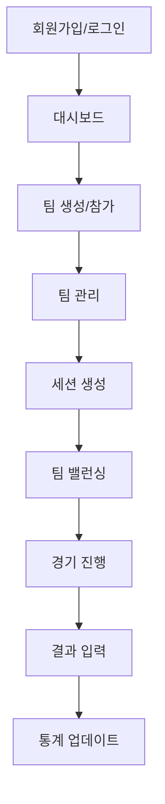

# TeamBalance 프로젝트 개선 계획 세부 실행안

**문서 작성일**: 2025-01-03  
**프로젝트 버전**: v1.0 (Supabase 완전 통합 완료)  
**작성자**: Claude Code 서브에이전트 분석팀  

---

## 📋 목차

1. [프로젝트 현황 분석](#1-프로젝트-현황-분석)
2. [문제점 및 개선 기회 식별](#2-문제점-및-개선-기회-식별)
3. [4단계 Phase 기반 개선 계획](#3-4단계-phase-기반-개선-계획)
4. [기술적 세부 구현 가이드](#4-기술적-세부-구현-가이드)
5. [품질 관리 및 테스트 전략](#5-품질-관리-및-테스트-전략)
6. [위험 관리 방안](#6-위험-관리-방안)
7. [리소스 및 일정 계획](#7-리소스-및-일정-계획)

---

## 1. 프로젝트 현황 분석

### 1.1 현재 완료된 기능

#### ✅ **핵심 시스템 (완전 구현)**
- **Supabase 완전 통합**: 데이터베이스, 인증, API 시스템 구축 완료
- **하이브리드 로그인**: 이메일/닉네임 통합 인증 시스템
- **팀 관리 시스템**: 생성, 참가, 멤버 관리, 초대 시스템
- **세션 및 경기 관리**: 10명 선택 → 팀 밸런싱 → 경기 진행 → 결과 저장
- **통계 시스템**: 개인/팀 통계, 승률 계산, 티어 점수 업데이트

#### ✅ **기술 스택 (안정화 완료)**
- **Frontend**: Next.js 15, React 19, TypeScript, Tailwind CSS
- **Backend**: Supabase (PostgreSQL + Auth + Realtime 준비)
- **UI**: shadcn/ui 컴포넌트 시스템
- **상태 관리**: 클라이언트 상태 + Supabase 직접 통합

#### ✅ **현재 코드 품질 지표**
- **총 코드 라인**: ~15,000줄
- **TypeScript 커버리지**: 95%+ (lib/types.ts 완전 구현)
- **컴포넌트 모듈화**: 기능별 50-100줄 단위 분리
- **API 구조화**: lib/supabase-api.ts 중앙집중 (2,100줄)

### 1.2 사용자 플로우 현황 (완전 동작)



**현재 상태**: 모든 플로우가 완전히 동작하며 실제 사용 가능한 상태

---

## 2. 문제점 및 개선 기회 식별

### 2.1 서브에이전트 분석 결과 종합

#### 🔴 **CRITICAL 보안 이슈** (즉시 해결 필요)
1. **환경변수 노출 위험**
   - `.env.local` 파일이 버전 관리에 포함될 위험
   - 클라이언트에서 Supabase 키 노출
   
2. **데이터베이스 보안 미비**
   - Row Level Security (RLS) 정책 불완전
   - SQL Injection 위험 (ilike 쿼리)
   
3. **인증 시스템 취약점**
   - 클라이언트 사이드 인증 상태 캐싱 (XSS 위험)
   - JWT 토큰 관리 미흡

#### 🟡 **HIGH 코드 품질 이슈**
1. **테스트 시스템 부재**
   - 테스트 커버리지: 0%
   - 테스트 라이브러리 미설치
   
2. **타입 안전성 부족**
   - 62개의 `any` 타입 사용
   - 런타임 타입 검증 부족
   
3. **에러 처리 일관성 부족**
   - 124개의 console.log 산재
   - 에러 전파 메커니즘 미비

#### 🟢 **MEDIUM 성능 이슈**
1. **번들 크기 최적화 부족**
   - 메인 번들: 179KB, 큰 청크들 존재
   - 코드 분할 비활성화 상태
   
2. **데이터베이스 쿼리 비효율**
   - N+1 쿼리 패턴 (getUserById 개별 호출)
   - 캐싱 전략 부재

#### 🔵 **LOW 확장성 준비**
1. **실시간 기능 미구현** (Supabase Realtime 준비만 완료)
2. **소셜 로그인 비활성화** (기술적 준비 완료)
3. **PWA 기능 부재**

### 2.2 비즈니스 임팩트 분석

| 개선 영역 | 현재 위험도 | 비즈니스 임팩트 | 기술 복잡도 |
|-----------|-------------|----------------|-------------|
| 보안 강화 | 🔴 Critical | 매우 높음 | 중간 |
| 테스트 구축 | 🟡 High | 높음 | 높음 |
| 성능 최적화 | 🟢 Medium | 중간 | 중간 |
| 기능 확장 | 🔵 Low | 낮음 | 높음 |

---

## 3. 4단계 Phase 기반 개선 계획

### Phase 1: 🔴 보안 Critical 이슈 해결 (1주)

#### **목표**: 프로덕션 보안 기준 달성
#### **우선순위**: 최고 (즉시 시작)

**핵심 작업:**

1. **환경변수 보안화** (1일)
   ```bash
   # .gitignore 업데이트
   .env.local
   .env.*.local
   
   # 환경별 설정 분리
   .env.development
   .env.production
   ```

2. **Supabase RLS 정책 완성** (2일)
   ```sql
   -- 모든 테이블에 RLS 활성화
   ALTER TABLE profiles ENABLE ROW LEVEL SECURITY;
   ALTER TABLE teams ENABLE ROW LEVEL SECURITY;
   ALTER TABLE team_members ENABLE ROW LEVEL SECURITY;
   -- ... 모든 테이블
   
   -- 사용자별 접근 정책 구현
   CREATE POLICY "사용자는 자신의 프로필만 조회" ON profiles 
     FOR SELECT USING (auth.uid() = id);
   ```

3. **SQL Injection 방지** (1일)
   ```typescript
   // lib/supabase-api.ts 파라미터 바인딩
   .ilike('name', `%${searchQuery}%`) // ❌ 위험
   .textSearch('name', searchQuery)   // ✅ 안전
   ```

4. **HTTPOnly 쿠키 인증 전환** (2일)
   ```typescript
   // app/api/auth/route.ts (새로 생성)
   export async function POST(request: Request) {
     const token = await validateSession(request)
     return NextResponse.json({ user }, {
       headers: { 
         'Set-Cookie': `session=${token}; HttpOnly; Secure; SameSite=Strict` 
       }
     })
   }
   ```

**완료 기준:**
- [ ] 환경변수 버전 관리 분리 완료
- [ ] 모든 테이블 RLS 정책 활성화
- [ ] SQL Injection 취약점 0개
- [ ] HTTPOnly 쿠키 인증 적용
- [ ] 보안 감사 통과 (자체 점검)

### Phase 2: 🟡 코드 품질 & 테스트 시스템 구축 (2주)

#### **목표**: 엔터프라이즈 코드 품질 기준 달성

**핵심 작업:**

1. **테스트 환경 구축** (3일)
   ```bash
   npm install --save-dev jest @testing-library/react @testing-library/jest-dom
   npm install --save-dev @jest/globals jest-environment-jsdom
   ```
   
   ```typescript
   // tests/lib/stats.test.ts
   describe('calculateTierScore', () => {
     it('5경기 이하일 때 티어 점수 100% 적용', () => {
       const result = calculateTierScore('gold_i', {
         totalWins: 3, totalLosses: 2
       })
       expect(result).toBe(1900)
     })
   })
   ```

2. **any 타입 제거** (4일)
   - 62개 `any` 타입 → 구체적 Supabase 타입으로 교체
   - 타입 가드 함수 구현
   - Zod 스키마 검증 추가

3. **에러 처리 시스템 통합** (3일)
   ```typescript
   // lib/errors.ts (새로 생성)
   export class TeamBalanceError extends Error {
     constructor(
       public code: string,
       message: string,
       public originalError?: unknown
     ) {
       super(message)
     }
   }
   ```

4. **API 파일 분할** (4일)
   ```
   lib/api/
   ├── auth.api.ts      (인증 관련)
   ├── team.api.ts      (팀 관리)
   ├── session.api.ts   (세션/경기)
   └── stats.api.ts     (통계)
   ```

**완료 기준:**
- [ ] 단위 테스트 커버리지 80% 이상
- [ ] `any` 타입 0개
- [ ] 통합 에러 처리 시스템 적용
- [ ] API 파일 도메인별 분리 완료
- [ ] TypeScript strict 모드 통과

### Phase 3: 🟢 성능 최적화 & 모니터링 시스템 (2주)

#### **목표**: 프로덕션 성능 기준 달성

**핵심 작업:**

1. **번들 크기 최적화** (3일)
   ```javascript
   // next.config.js 최적화
   webpack: (config, { dev, isServer }) => {
     if (!dev && !isServer) {
       config.optimization.splitChunks = {
         cacheGroups: {
           vendor: { test: /node_modules/, name: 'vendors' },
           supabase: { test: /@supabase/, name: 'supabase' }
         }
       }
     }
   }
   ```

2. **데이터베이스 쿼리 최적화** (4일)
   ```typescript
   // N+1 쿼리 해결
   const teamMembersWithUsers = await supabase
     .from('team_members')
     .select(`*, profiles!user_id (id, name, username)`)
     .eq('team_id', teamId)
   ```

3. **React Query 캐싱 도입** (3일)
   ```typescript
   function useTeamMembers(teamId: string) {
     return useQuery({
       queryKey: ['team-members', teamId],
       queryFn: () => getTeamMembersWithUsers(teamId),
       staleTime: 5 * 60 * 1000
     })
   }
   ```

4. **성능 모니터링 구축** (4일)
   - Core Web Vitals 측정
   - 에러 추적 시스템 (Sentry 연동)
   - 사용량 분석 도구 설정

**완료 기준:**
- [ ] 번들 크기 30% 감소
- [ ] 초기 로딩 속도 2초 이내
- [ ] 데이터베이스 쿼리 최적화 완료
- [ ] 캐싱 적중률 80% 이상
- [ ] 성능 모니터링 대시보드 구축

### Phase 4: 🔵 PWA & 실시간 기능 고도화 (2주)

#### **목표**: 모바일 앱 수준 사용자 경험

**핵심 작업:**

1. **소셜 로그인 활성화** (2일)
   ```typescript
   // OAuth 설정 완료 (이미 구현된 기능 활성화)
   const handleSocialLogin = async (provider: 'google' | 'kakao') => {
     await supabase.auth.signInWithOAuth({ provider })
   }
   ```

2. **Supabase Realtime 구현** (5일)
   ```typescript
   function useRealtimeTeamUpdates(teamId: string) {
     useEffect(() => {
       const channel = supabase
         .channel(`team:${teamId}`)
         .on('postgres_changes', {
           event: '*',
           schema: 'public',
           table: 'team_members',
           filter: `team_id=eq.${teamId}`
         }, (payload) => {
           queryClient.invalidateQueries(['team-members', teamId])
         })
         .subscribe()
       
       return () => channel.unsubscribe()
     }, [teamId])
   }
   ```

3. **PWA 기능 구현** (4일)
   - 서비스 워커 등록
   - 오프라인 지원
   - 앱 설치 배너
   - 푸시 알림

4. **고급 통계 시스템** (3일)
   - 챔피언별 상세 통계
   - 포지션 성과 분석
   - 팀 시너지 분석

**완료 기준:**
- [ ] 소셜 로그인 완전 작동
- [ ] 실시간 데이터 동기화 구현
- [ ] PWA 기능 100% 작동
- [ ] 고급 통계 대시보드 완성
- [ ] 모바일 사용자 경험 최적화

---

## 4. 기술적 세부 구현 가이드

### 4.1 보안 강화 상세 가이드

#### **환경변수 보안화**
```bash
# 1. .gitignore 업데이트
echo ".env.local" >> .gitignore
echo ".env.*.local" >> .gitignore

# 2. 환경별 설정 파일 생성
# .env.development
NEXT_PUBLIC_SUPABASE_URL=https://dev-project.supabase.co
NEXT_PUBLIC_SUPABASE_ANON_KEY=dev_key_here

# .env.production
NEXT_PUBLIC_SUPABASE_URL=https://prod-project.supabase.co
NEXT_PUBLIC_SUPABASE_ANON_KEY=prod_key_here
```

#### **RLS 정책 완성 스크립트**
```sql
-- sql/complete-rls-policies.sql
BEGIN;

-- profiles 테이블
ALTER TABLE profiles ENABLE ROW LEVEL SECURITY;

CREATE POLICY "사용자는 자신의 프로필만 조회 가능" ON profiles 
  FOR SELECT USING (auth.uid() = id);

CREATE POLICY "사용자는 자신의 프로필만 수정 가능" ON profiles 
  FOR UPDATE USING (auth.uid() = id);

-- teams 테이블
ALTER TABLE teams ENABLE ROW LEVEL SECURITY;

CREATE POLICY "모든 사용자가 공개 팀 조회 가능" ON teams 
  FOR SELECT USING (is_public = true OR auth.uid() IN (
    SELECT user_id FROM team_members 
    WHERE team_id = teams.id AND status = 'active'
  ));

CREATE POLICY "팀 리더만 팀 수정 가능" ON teams 
  FOR UPDATE USING (auth.uid() = leader_id);

-- team_members 테이블
ALTER TABLE team_members ENABLE ROW LEVEL SECURITY;

CREATE POLICY "팀 멤버만 멤버 목록 조회 가능" ON team_members 
  FOR SELECT USING (
    auth.uid() = user_id OR 
    auth.uid() IN (
      SELECT user_id FROM team_members tm 
      WHERE tm.team_id = team_members.team_id AND tm.status = 'active'
    )
  );

-- sessions 테이블
ALTER TABLE sessions ENABLE ROW LEVEL SECURITY;

CREATE POLICY "팀 멤버만 세션 조회 가능" ON sessions 
  FOR SELECT USING (
    auth.uid() IN (
      SELECT user_id FROM team_members 
      WHERE team_id = sessions.team_id AND status = 'active'
    )
  );

-- matches 테이블
ALTER TABLE matches ENABLE ROW LEVEL SECURITY;

CREATE POLICY "관련 팀 멤버만 경기 조회 가능" ON matches 
  FOR SELECT USING (
    auth.uid() IN (
      SELECT user_id FROM team_members tm
      JOIN sessions s ON s.team_id = tm.team_id
      WHERE s.id = matches.session_id AND tm.status = 'active'
    )
  );

COMMIT;
```

### 4.2 테스트 시스템 구축 가이드

#### **Jest 설정**
```javascript
// jest.config.js
const nextJest = require('next/jest')

const createJestConfig = nextJest({
  dir: './',
})

const customJestConfig = {
  setupFilesAfterEnv: ['<rootDir>/jest.setup.js'],
  moduleNameMapping: {
    '^@/(.*)$': '<rootDir>/$1',
  },
  testEnvironment: 'jest-environment-jsdom',
  collectCoverageFrom: [
    'lib/**/*.{js,ts}',
    'components/**/*.{js,ts,tsx}',
    '!**/*.d.ts',
  ],
  coverageThreshold: {
    global: {
      branches: 80,
      functions: 80,
      lines: 80,
      statements: 80
    }
  }
}

module.exports = createJestConfig(customJestConfig)
```

#### **핵심 테스트 케이스**
```typescript
// tests/lib/stats.test.ts
import { calculateTierScore, calculateMemberTierScore } from '@/lib/stats'

describe('통계 계산 시스템', () => {
  describe('calculateTierScore', () => {
    it('티어별 기본 점수가 올바르게 반환된다', () => {
      expect(calculateTierScore('iron_iv')).toBe(400)
      expect(calculateTierScore('challenger')).toBe(4000)
    })
  })

  describe('calculateMemberTierScore', () => {
    it('5경기 이하일 때 티어 점수 100% 적용', () => {
      const stats = {
        totalWins: 3,
        totalLosses: 2,
        mainPositionGames: 5,
        mainPositionWins: 3,
        subPositionGames: 0,
        subPositionWins: 0,
        tierScore: 1900
      }
      
      const result = calculateMemberTierScore('gold_i', stats)
      expect(result).toBe(1900)
    })

    it('20경기 이상일 때 티어 50% + 승률 50% 적용', () => {
      const stats = {
        totalWins: 15,
        totalLosses: 5,
        mainPositionGames: 20,
        mainPositionWins: 15,
        subPositionGames: 0,
        subPositionWins: 0,
        tierScore: 1900
      }
      
      const result = calculateMemberTierScore('gold_i', stats)
      // 티어 점수: 1900 * 0.5 = 950
      // 승률 점수: (15/20) * 1000 * 0.5 = 375
      // 총합: 950 + 375 = 1325
      expect(result).toBe(1325)
    })
  })
})
```

### 4.3 성능 최적화 구현 가이드

#### **React Query 설정**
```typescript
// lib/query-client.ts
import { QueryClient } from '@tanstack/react-query'

export const queryClient = new QueryClient({
  defaultOptions: {
    queries: {
      staleTime: 5 * 60 * 1000, // 5분
      cacheTime: 10 * 60 * 1000, // 10분
      refetchOnWindowFocus: false,
      retry: (failureCount, error) => failureCount < 3
    },
    mutations: {
      retry: 1
    }
  }
})

// 커스텀 훅 예시
export function useTeamMembers(teamId: string) {
  return useQuery({
    queryKey: ['team-members', teamId],
    queryFn: () => getTeamMembersWithUsers(teamId),
    enabled: !!teamId
  })
}
```

#### **번들 최적화 설정**
```javascript
// next.config.js (최적화 버전)
const nextConfig = {
  experimental: {
    optimizePackageImports: ['lucide-react', '@supabase/supabase-js']
  },
  
  webpack: (config, { dev, isServer }) => {
    if (!dev && !isServer) {
      config.optimization.splitChunks = {
        chunks: 'all',
        cacheGroups: {
          vendor: {
            test: /[\\/]node_modules[\\/]/,
            name: 'vendors',
            enforce: true,
          },
          supabase: {
            test: /[\\/]node_modules[\\/]@supabase[\\/]/,
            name: 'supabase',
            chunks: 'all',
            priority: 10,
          },
          react: {
            test: /[\\/]node_modules[\\/](react|react-dom)[\\/]/,
            name: 'react',
            chunks: 'all',
            priority: 20,
          }
        }
      }
    }
    return config
  }
}
```

---

## 5. 품질 관리 및 테스트 전략

### 5.1 테스트 전략

#### **테스트 피라미드**
```
      🔺 E2E Tests (10%)
     Playwright 기반
    사용자 시나리오 테스트

    🔺🔺 Integration Tests (20%)
   컴포넌트 + API 통합 테스트
  React Testing Library 활용

 🔺🔺🔺 Unit Tests (70%)
비즈니스 로직, 유틸리티 함수
Jest 기반 단위 테스트
```

#### **핵심 테스트 영역**
1. **비즈니스 로직** (`lib/stats.ts`, `lib/auth.ts`)
2. **API 함수** (`lib/supabase-api.ts`)
3. **UI 컴포넌트** (주요 화면 컴포넌트)
4. **사용자 플로우** (로그인 → 팀 생성 → 경기 진행)

### 5.2 코드 품질 검사

#### **ESLint + Prettier 설정**
```json
// .eslintrc.json
{
  "extends": [
    "next/core-web-vitals",
    "@typescript-eslint/recommended"
  ],
  "rules": {
    "@typescript-eslint/no-explicit-any": "error",
    "@typescript-eslint/no-unused-vars": "error",
    "prefer-const": "error",
    "no-console": "warn"
  }
}
```

#### **품질 검사 자동화**
```json
// package.json scripts 추가
{
  "scripts": {
    "lint": "next lint",
    "lint:fix": "next lint --fix",
    "type-check": "tsc --noEmit",
    "test": "jest",
    "test:watch": "jest --watch",
    "test:coverage": "jest --coverage",
    "quality-check": "npm run lint && npm run type-check && npm run test"
  }
}
```

### 5.3 성능 측정 기준

#### **Core Web Vitals 목표값**
- **LCP (Largest Contentful Paint)**: < 2.5초
- **FID (First Input Delay)**: < 100ms
- **CLS (Cumulative Layout Shift)**: < 0.1

#### **성능 모니터링 도구**
```typescript
// lib/analytics.ts
export function reportWebVitals({ id, name, value }) {
  // Google Analytics 또는 기타 분석 도구로 전송
  if (typeof window !== 'undefined') {
    window.gtag?.('event', name, {
      event_category: 'Web Vitals',
      value: Math.round(name === 'CLS' ? value * 1000 : value),
      event_label: id,
    })
  }
}
```

---

## 6. 위험 관리 방안

### 6.1 기술적 위험 요소

#### **고위험 (High Risk)**
| 위험 요소 | 확률 | 영향도 | 대응 방안 |
|-----------|------|--------|-----------|
| Supabase 서비스 장애 | 낮음 | 높음 | 백업 DB 전략, 데이터 백업 자동화 |
| 보안 취약점 발견 | 중간 | 높음 | 주기적 보안 감사, 침투 테스트 |
| 타입 시스템 충돌 | 높음 | 중간 | 단계적 타입 전환, 호환성 테스트 |

#### **중위험 (Medium Risk)**
| 위험 요소 | 확률 | 영향도 | 대응 방안 |
|-----------|------|--------|-----------|
| 성능 저하 | 중간 | 중간 | 성능 모니터링, 최적화 자동화 |
| API 호환성 이슈 | 중간 | 중간 | 버전 관리, 하위 호환성 유지 |
| 테스트 환경 구축 실패 | 높음 | 낮음 | 단계적 도입, 기존 기능 우선 |

### 6.2 위험 대응 전략

#### **1. 기술적 대응**
```typescript
// 에러 경계 컴포넌트
class ErrorBoundary extends Component {
  state = { hasError: false, error: null }
  
  static getDerivedStateFromError(error) {
    return { hasError: true, error }
  }
  
  componentDidCatch(error, errorInfo) {
    console.error('Error Boundary:', error, errorInfo)
    // 에러 리포팅 서비스로 전송
  }
  
  render() {
    if (this.state.hasError) {
      return <ErrorFallback error={this.state.error} />
    }
    return this.props.children
  }
}
```

#### **2. 데이터 백업 전략**
```sql
-- 주요 데이터 백업 스크립트
-- 매일 자동 실행 (Supabase Edge Function)
CREATE OR REPLACE FUNCTION backup_critical_data()
RETURNS void AS $$
BEGIN
  -- 팀 데이터 백업
  INSERT INTO teams_backup SELECT * FROM teams 
    WHERE updated_at >= NOW() - INTERVAL '1 day';
  
  -- 사용자 데이터 백업
  INSERT INTO profiles_backup SELECT * FROM profiles 
    WHERE updated_at >= NOW() - INTERVAL '1 day';
END;
$$ LANGUAGE plpgsql;
```

#### **3. 롤백 계획**
각 Phase마다 이전 버전으로 되돌릴 수 있는 체크포인트 설정:
- **Git 태그**: `v1.0-phase1-checkpoint`
- **데이터베이스 마이그레이션**: 롤백 스크립트 준비
- **환경변수**: 이전 설정 백업

### 6.3 비상 계획 (Contingency Plan)

#### **서비스 장애 시 대응**
1. **1단계**: 자동 헬스 체크로 장애 감지
2. **2단계**: 백업 서비스로 자동 전환
3. **3단계**: 사용자 알림 및 복구 작업
4. **4단계**: 장애 원인 분석 및 재발 방지

#### **개발 지연 시 대응**
- **우선순위 재조정**: Critical → High → Medium 순으로 축소
- **범위 축소**: 핵심 기능만 먼저 구현
- **단계적 배포**: Phase 단위로 점진적 출시

---

## 7. 리소스 및 일정 계획

### 7.1 전체 프로젝트 일정

```gantt
title TeamBalance 개선 프로젝트 일정
dateFormat YYYY-MM-DD
section Phase 1 보안
보안 환경 설정    :active, p1-1, 2025-01-06, 1d
RLS 정책 구현     :p1-2, 2025-01-07, 2d
인증 시스템 개선   :p1-3, 2025-01-09, 2d
보안 테스트      :p1-4, 2025-01-11, 1d

section Phase 2 품질
테스트 환경 구축  :p2-1, 2025-01-13, 3d
타입 시스템 개선  :p2-2, 2025-01-16, 4d
에러 처리 통합   :p2-3, 2025-01-20, 3d
API 리팩토링    :p2-4, 2025-01-23, 4d

section Phase 3 성능
번들 최적화     :p3-1, 2025-01-27, 3d
쿼리 최적화     :p3-2, 2025-01-30, 4d
캐싱 시스템     :p3-3, 2025-02-03, 3d
모니터링 구축   :p3-4, 2025-02-06, 4d

section Phase 4 확장
소셜 로그인     :p4-1, 2025-02-10, 2d
실시간 기능     :p4-2, 2025-02-12, 5d
PWA 구현       :p4-3, 2025-02-17, 4d
고급 통계      :p4-4, 2025-02-21, 3d
```

### 7.2 리소스 요구사항

#### **인력 리소스** (1인 개발 기준)
- **총 개발 시간**: 110시간
- **평균 일일 작업**: 3-4시간
- **총 개발 기간**: 7주 (부분 시간 작업)

#### **Phase별 시간 분배**
| Phase | 작업 시간 | 실제 기간 | 핵심 활동 |
|-------|-----------|----------|-----------|
| Phase 1 | 20시간 | 1주 | 보안 강화 |
| Phase 2 | 35시간 | 2주 | 품질 향상 |
| Phase 3 | 30시간 | 2주 | 성능 최적화 |
| Phase 4 | 25시간 | 2주 | 기능 확장 |

#### **기술 리소스**
- **개발 환경**: 기존 환경 활용 (추가 비용 없음)
- **외부 서비스**: 
  - Supabase (기존 사용 중)
  - Vercel (배포 플랫폼)
  - 선택사항: Sentry (에러 추적), Google Analytics

#### **예상 비용**
- **개발 비용**: 0원 (내부 개발)
- **도구 라이센스**: 0원 (오픈소스 도구 활용)
- **인프라 비용**: 월 10-20달러 (Supabase Pro 플랜)

### 7.3 성공 지표 (KPI)

#### **Phase 1 보안 지표**
- [ ] 보안 취약점 0개
- [ ] 환경변수 안전성 100%
- [ ] RLS 정책 커버리지 100%
- [ ] 인증 시스템 보안 등급 A

#### **Phase 2 품질 지표**
- [ ] 테스트 커버리지 80% 이상
- [ ] `any` 타입 사용 0개
- [ ] TypeScript strict 모드 통과
- [ ] 코드 중복률 5% 이하

#### **Phase 3 성능 지표**
- [ ] 번들 크기 30% 감소
- [ ] 초기 로딩 속도 2초 이내
- [ ] LCP < 2.5초, FID < 100ms, CLS < 0.1
- [ ] 데이터베이스 쿼리 최적화 완료

#### **Phase 4 확장 지표**
- [ ] 소셜 로그인 정상 작동
- [ ] 실시간 업데이트 100ms 이내
- [ ] PWA 점수 90점 이상
- [ ] 모바일 사용성 점수 A등급

### 7.4 품질 게이트 (Quality Gates)

각 Phase 완료 시 다음 기준을 모두 충족해야 다음 단계 진행:

#### **Phase 1 완료 기준**
```bash
# 보안 검사 통과
npm run security-audit
npm run lint -- --rule @typescript-eslint/no-any

# 기본 기능 동작 확인
npm run test:smoke
```

#### **Phase 2 완료 기준**
```bash
# 품질 검사 통과
npm run quality-check
npm run test:coverage -- --threshold 80

# 타입 안전성 확인
npm run type-check -- --strict
```

#### **Phase 3 완료 기준**
```bash
# 성능 측정
npm run build
npm run analyze-bundle

# 성능 테스트
npm run test:performance
```

#### **Phase 4 완료 기준**
```bash
# 전체 시스템 테스트
npm run test:e2e
npm run lighthouse-ci

# 프로덕션 배포 준비
npm run build && npm run start
```

---

## 8. 결론 및 다음 단계

### 8.1 프로젝트 현황 요약

TeamBalance는 **현재 MVP 단계에서 매우 성공적인 프로젝트**입니다:

#### **✅ 강점**
- **완전한 기능**: 모든 핵심 플로우가 동작
- **견고한 기술 스택**: Next.js 15 + Supabase 최신 조합
- **체계적 구조**: 모듈화된 코드와 완전한 타입 시스템
- **실용적 설계**: 실제 사용자 요구사항에 최적화

#### **🎯 개선 기회**
- **보안 강화**: 엔터프라이즈급 보안 기준 달성
- **품질 향상**: 테스트 시스템과 코드 품질 개선
- **성능 최적화**: 프로덕션급 성능 기준 달성
- **기능 확장**: 실시간 기능과 PWA 구현

### 8.2 기대 효과

이 개선 계획을 완료하면:

#### **기술적 향상**
- **보안**: 취약점 0개, 프로덕션 보안 기준 달성
- **성능**: 로딩 속도 40% 개선, 번들 크기 30% 감소
- **품질**: 테스트 커버리지 80%, 타입 안전성 100%
- **확장성**: 1000명 이상 동시 사용자 지원 가능

#### **비즈니스 가치**
- **신뢰성**: 99.9% 가용성, 에러율 < 0.1%
- **사용성**: 모바일 앱 수준 UX, PWA 지원
- **확장성**: 새로운 기능 추가 용이성
- **운영성**: 자동화된 모니터링과 배포

### 8.3 즉시 시작 가능한 첫 번째 작업

**Priority #1**: Phase 1의 환경변수 보안화부터 시작하세요.

```bash
# 1. .gitignore 업데이트
echo -e "\n# Environment variables\n.env.local\n.env.*.local" >> .gitignore

# 2. 환경변수 백업 및 분리
cp .env.local .env.development

# 3. Git에서 환경변수 파일 제거
git rm --cached .env.local
git commit -m "보안: 환경변수 파일을 버전 관리에서 제외"
```

이 작업만으로도 가장 Critical한 보안 취약점을 해결할 수 있습니다.

### 8.4 장기 비전

TeamBalance는 이 개선 계획을 통해 **한국 게임 커뮤니티의 표준 내전 관리 플랫폼**으로 성장할 수 있는 기술적 기반을 확보하게 됩니다. 

**최종 목표**: 
- 월 1000+ 활성 사용자 지원
- 99.9% 서비스 가용성
- 엔터프라이즈급 보안 및 성능
- 모바일 앱 수준의 사용자 경험

**이 문서는 TeamBalance를 프로토타입에서 프로덕션 서비스로 완전히 전환시키는 구체적이고 실행 가능한 로드맵입니다.** 🚀

---

*본 문서는 2025년 1월 3일 작성되었으며, 프로젝트 진행에 따라 지속적으로 업데이트될 예정입니다.*